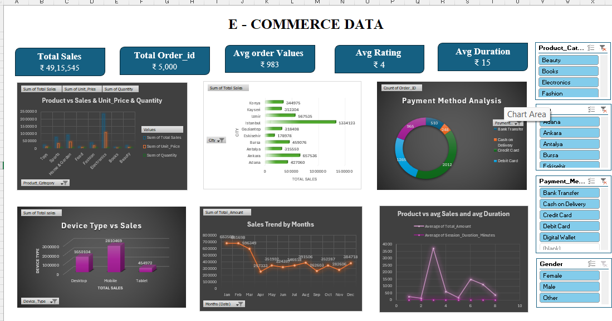
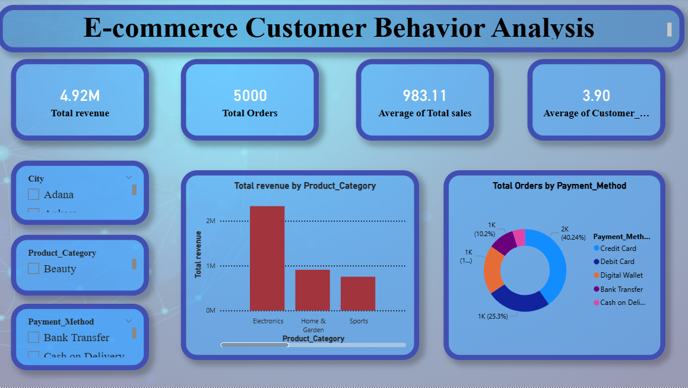
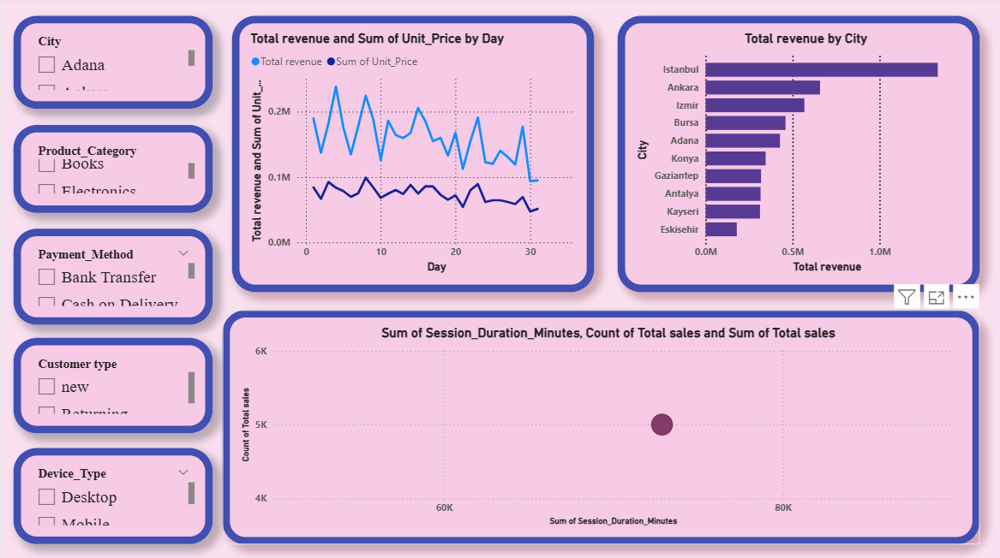

# E-Commerce Sales Analytics 

## Project Overview

This project presents a comprehensive E-Commerce Customer Behavior and Sales Analysis dashboard developed to analyze transactional and customer interaction data.
The project focuses on understanding revenue performance, customer behavior patterns, product performance, payment trends, device usage, and session duration insights.
It demonstrates the end-to-end analytics lifecycle including data cleaning, KPI creation, exploratory analysis, and interactive dashboard development.

---

## Business Objectives

- Analyze total revenue and order performance
- Understand customer purchasing behavior
- Identify top-performing product categories
- Evaluate payment method preferences
- Analyze city-wise revenue distribution
- Study device usage impact on sales
- Track session duration and customer engagement
- Monitor monthly sales trends  

---

## Tools & Technologies

- **Excel** – Data Cleaning & KPI Creation  
- **SQL** – Business Querying & Aggregation  
- **Python (Pandas, Matplotlib)** – Exploratory Data Analysis  
- **Power BI** – Interactive Dashboard Development  

---

## Key Performance Indicators (KPIs)

- Total Revenue: 4.92M  
- Total Orders: 5000  
- Average Order Value: 983  
- Average Customer Rating: 3.9  
- Total Sales Amount: ₹49,15,545  
- Average Session Duration  

---
## Dashboard Features

### Revenue Analysis
- Total revenue by product category
- Electronics category generates highest revenue
- Monthly sales trend visualization
- City-wise revenue comparison

### Customer Behavior Analysis
- New vs Returning customers
- Customer rating analysis
- Session duration impact on sales
- Engagement level measurement

### Payment Method Analysis
- Orders distribution by payment method
- Credit Card and Digital Wallet dominate transactions
- Cash on Delivery and Bank Transfer share analysis

### Device Type Analysis
- Sales comparison between Desktop, Mobile, and Tablet
- Mobile users generate highest revenue

### Product Performance
- Category-wise sales and quantity analysis
- Average sales vs average session duration comparison

---

## Project Workflow

### Data Cleaning (Excel / Python)

- Removed missing and duplicate values  
- Standardized date and currency formats  
- Created calculated columns (Revenue, Profit, AOV)  
- Ensured consistency across product and customer data  

### SQL Analysis

- Calculated Total Revenue and Total Orders  
- Monthly and Yearly Sales Aggregation  
- Customer Segmentation Analysis  
- Product Category Performance  
- Regional Sales Breakdown  

### Python Exploratory Data Analysis

- Revenue distribution analysis  
- Top product performance visualization  
- Customer purchase frequency analysis  
- Monthly trend analysis using line charts  
- Profitability analysis  

### Power BI Dashboard Development

- KPI Cards (Revenue, Orders, AOV, Customers)  
- Sales by Category  
- Top Products Analysis  
- Regional Sales Map  
- Monthly Sales Trend  
- Interactive Slicers (Date, Region, Category)  

---

## Key Insights

- Electronics category contributes the highest share of total revenue.
- Mobile device users generate more sales compared to desktop and tablet users.
- Credit Card and Digital Wallet are the most preferred payment methods.
- Certain cities significantly outperform others in revenue generation.
- Higher session duration positively impacts total sales.
- Returning customers contribute strongly to overall revenue.  

---

## Dashboard Preview

---

## Business Impact

This dashboard enables e-commerce decision-makers to:

- Identify high-performing product categories
- Optimize marketing strategies based on customer behavior
- Improve payment experience optimization
- Focus on high-performing regions and devices
- Enhance customer retention strategies
- Make data-driven decisions using real-time KPIs 

---

## Skills Demonstrated

- Data Cleaning & Transformation
- KPI Development
- SQL Aggregation & Analysis
- Customer Segmentation
- Exploratory Data Analysis (EDA)
- Interactive Dashboard Design
- Business Insight Generation

---

## Conclusion

This project demonstrates a complete E-Commerce Customer Behavior Analytics solution that transforms raw transactional and session data into actionable business insights.

It highlights strong analytical thinking, data visualization expertise, and business intelligence skills aligned with Data Analyst and Business Intelligence roles.
